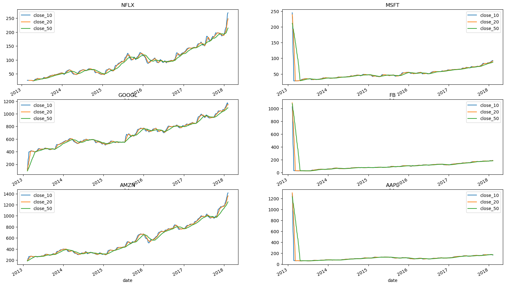
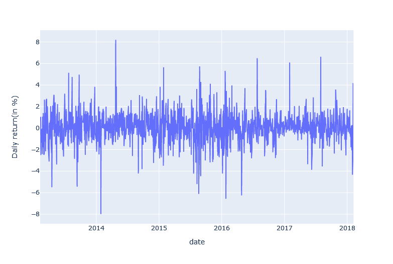
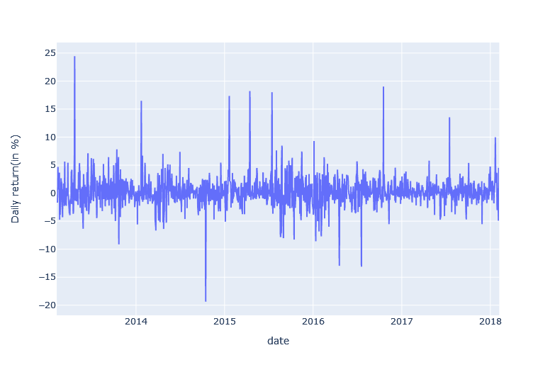
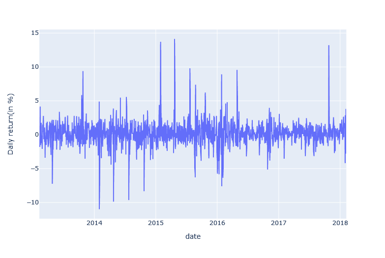

# S&P500 Data Analysis Project

# Overview
This project conducts a thorough analysis of S&P 500 stock data, exploring trends, moving averages, and correlations among tech giants, providing insights for investors.

# Table of Contents

- Installation
- Data Collection
- Data Analysis
  - Price Change Analysis
  - Moving Average
  - Closing Price Change in Apple, Netflix & Amazon Stock
  - Resampling Analysis
  - Correlation Among Tech Companies
  - Daily Change vs. Daily Returns
- Usage
- License

  # Installation

  To run this project, you need the following dependencies installed:
- pandas
- seaborn
- numpy
- matplotlib
- emoji
- plotly

  # Data Collection

  Using glob module to search CSV files and use it for our need

  ```bash
  import glob
  ```

  # Data Analysis

  ### Price Change Analysis
  Analysing the change in prices of the stock overtime
  

  ### Moving Average
  Analysing the Moving average of the various stocks
  

  ### Closing Price Change in Apple, Netflix & Amazon Stock
  Analysing Closing price change in Apple stock
  

  Analysing Closing price change in Netflix stock
  

  Analysing Closing price change in Amazon stock
  

  ### Resampling Analysis
  Performing resampling analysis of closing price of Apple Stock

  #### Resampling data on Date basis
  
  #### Resampling data on Montly basis
  
  #### Resampling data on Yearly basis
  
  #### Resampling data on Quarterly basis
  

  ### Correlation Among Tech Companies
  Analysing Whether closing prices of these tech companies (Amazon,Apple,Facebook,Google,Netflix,Microsoft) are correlated 
  or not

  ## Pair Plot
  
  ## Heatmap
  

  Conclusions :
  Closing price of Google and Microsoft, Facebook and Microsoft, Google and Facebook, Amazon and Google are well 
  correlated. Closing prices have a co-relation of 0.97

  ### Daily Change vs. Daily Returns
  Analysing Whether Daily change in Closing price of stocks or Daily Returns in Stock are co-related or not

  ## Pair Grid
  


  ### Amazon and Google stocks has highest correlation between them
  ### Conclusion: If Amazon stocks decreases, then there is a 54% probablity that Google stocks also decreases

  # Usage

  Clone the repository:

  ```bash
  git clone https://github.com/your-username/your-repository.git
  cd your-repository
  ```
  Latest Version of Anaconda software environment is required!


 # License
 This project is licensed under the MIT License.


 

  

  
  
  
  


  
